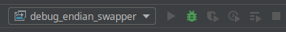

### Debugging Cocotb verification scripts with PyCharm

Please note these steps require PyCharm remote debugger server which is only available with the Professional (non-free) edition.

#### Step 1

Create a Remote Debug Server Configuration. More details [here](https://www.jetbrains.com/help/pycharm/2016.3/remote-debugging.html#6).

 

#### Step 2 

Include and configure pydevd in your Cocotb python file

```python
import pydevd
pydevd.settrace('localhost', port=9090, stdoutToServer=True, stderrToServer=True)
```

#### Step 3

Run the Remote Debug Server


#### Step 4 

Run the verification script Makefile specifying specifying the path to pydevd


#### Step 5 

Debug!


