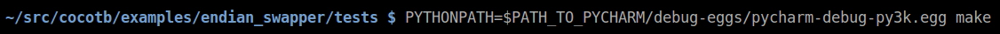

### Debugging Cocotb verification scripts with PyCharm

Cocotb scripts are executed by a python interpreter embedded in a native library which is dynamically loaded by a simulator at test runtime. Happily, you don't need to understand much about all of that to use Cocotb, but the indirection does mean a bit of scaffolding is necessary to enable visual debugging of scripts in PyCharm. 

Complete Cocotb docs can be found [here](https://cocotb.readthedocs.io/en/latest/).

Unfortunately the steps below do require Remote Debug Server which is only available with the Professional (non-free) edition of PyCharm. 


#### Step 1

Create a Remote Debug Server Configuration. More details [here](https://www.jetbrains.com/help/pycharm/2016.3/remote-debugging.html#6).

 

#### Step 2 

Include and configure pydevd in your Cocotb python file

```python
import pydevd
pydevd.settrace('localhost', port=9090, stdoutToServer=True, stderrToServer=True)
```

#### Step 3

Run the Remote Debug Server


#### Step 4 

Run the verification script Makefile specifying the path to pydevd.



#### Step 5 

Step through debugging in PyCharm.


