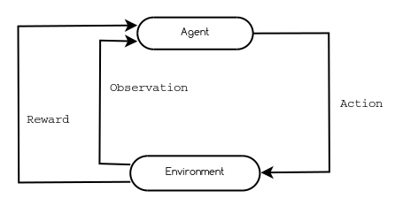
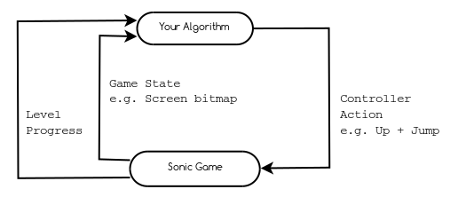

## OpenAI Retro Contest (Part 1 - Gym)

On April 5th the folks at [OpenAI](https://openai.com/) launched a [reinforcement learning contest](https://contest.openai.com/) based on the first three Sonic games for Sega’s 16-bit Mega Drive game console (aka the Sega Genesis in North America).
The goal of the competition is to create an AI player agent that advances the furthest through a set of undisclosed custom levels created with [SonLVL](http://info.sonicretro.org/SonLVL). 

The official website includes a [Quickstart](https://contest.openai.com/details) for getting up and running. It seems to me that following those instructions would be the best first step for anyone looking to get involved in the contest. As a follow on, I thought I'd write-up a set of short introductory guides to the assorted tools and libraries used in the contest. Hopefully learning a bit about the various pieces of infrastructure and how they hang together will be useful background not only for this contest but for future projects and research as well.

### Reinforcement Learning

The Gym toolkit is the core that all other contest tools build on. The [Gym site](https://gym.openai.com/) describes it as "a toolkit for developing and comparing reinforcement learning algorithms". Before trying to understand Gym though, it's useful to understand a little bit about the standard reinforcement learning metaphor.

In reinforcement learning, the machine learning "problem" is expressed as **agents** making **observations** of, taking **actions** on, and collecting **rewards** from an **environment**. The passage of time is broken up into discrete time **steps**.

 

### Sonic

The Gym toolkit defines a handy Python API for working with this characteristic reinforcement learning structure. Concretely, in the OpenAI contest, the **environment** is the Sonic game and the **agent** is the player algorithm implemented by contestants. In this context, the **observations** are game state data (screen pixels, remaining lives, etc) at a given time (which is incremented in **steps**). The **actions** are represented by the set of all possible console controller commands (up, jump, left, etc). Finally, the **reward** is a numeric value indicating level completion progress encoded as Sonic's horizontal offset from the start of the level.



The contest Quickstart includes an [agent](https://contest.openai.com/static/random-agent.py) that selects a random game controller action with each time step. In this simple example, the entire reinforcement learning problem structure is expressed in three lines of code.

Create an instance of the Sonic game **environment** and expose it as an object which subclasses Gym *[Env](https://github.com/openai/gym/blob/master/gym/core.py)*.
```python
   env = make(game='SonicTheHedgehog-Genesis', state='LabyrinthZone.Act1')
 ```
Advance time in **steps** with calls to *step()*. With each **step** the **environment** is passed an **action**, selected by a call to *env.action_space.sample()* which can be thought of as very simple **agent** algorithm that selects a random sample from the spaces of all **actions** defined for the **environment**.  After each **step** a numeric *rew*, is returned indicating the **reward** for the current **step**. Similarly *step()* returns *obs*, a object with **observation** data for the Sonic game **environment** at this time **step**.
```python
    while True:
        obs, rew, done, info = env.step(env.action_space.sample())
```
### Generalizing

Gym provides access to many different types of [environments](https://gym.openai.com/envs) and, as you would figure, programmers can create their own. Regardless of the complexity of the environment though, research using Gym will very likely include top level code to invoke the high level reinforcment learning problem structure.

As an example, OpenAI released a Competitive Self Play [paper](https://arxiv.org/abs/1710.03748) in October 2017.

[](https://www.youtube.com/watch?v=OBcjhp4KSgQ)

Looking at the code [main.py](https://github.com/openai/multiagent-competition/blob/master/main.py) it's easy to spot the **environment** setup...

```python
def run(config):
    if config.env == "kick-and-defend":
        env = gym.make("kick-and-defend-v0")
        policy_type = "lstm"
    elif config.env == "run-to-goal-humans":
        env = gym.make("run-to-goal-humans-v0")
        policy_type = "mlp"
    elif config.env == "run-to-goal-ants":
        env = gym.make("run-to-goal-ants-v0")
        policy_type = "mlp"
    elif config.env == "you-shall-not-pass":
        env = gym.make("you-shall-not-pass-humans-v0")
        policy_type = "mlp"
    elif config.env == "sumo-humans":
        env = gym.make("sumo-humans-v0")
        policy_type = "lstm"
    elif config.env == "sumo-ants":
        env = gym.make("sumo-ants-v0")
        policy_type = "lstm"
    else:
        print("unsupported environment")
        print("choose from: run-to-goal-humans, run-to-goal-ants, you-shall-not-pass, sumo-humans, sumo-ants, kick-and-defend")
        sys.exit()
#...
```
and a loop of **action**s against the **environment** resulting in an **observation** and a **reward**. 

```python
    while num_episodes < max_episodes:
        env.render()
        action = tuple([policy[i].act(stochastic=True, observation=observation[i])[0]
                        for i in range(len(policy))])
        observation, reward, done, infos = env.step(action)
```

### Next

In part 2 we'll take a look at [Gym Retro](https://github.com/openai/retro) a library that exposes console games as Gym environments. 

If you want to dig deeper into Gym the [docs](https://gym.openai.com/docs/) and [source code](https://github.com/openai/gym) are good places to start. 

Richard Sutton, one of the most important names in reinforcement learning, has made the complete draft of the much anticipated 2nd edition of his *Reinforcement Learning: An Introduction* freely [available](http://incompleteideas.net/book/the-book-2nd.html) online. For a (light years) more authoritative overview of the environment agent loop checkout section 1.1 and for the formal treatment look to section 3.1

Thanks for reading, I hope this was of some use to you. See you in Part 2.

--- 



